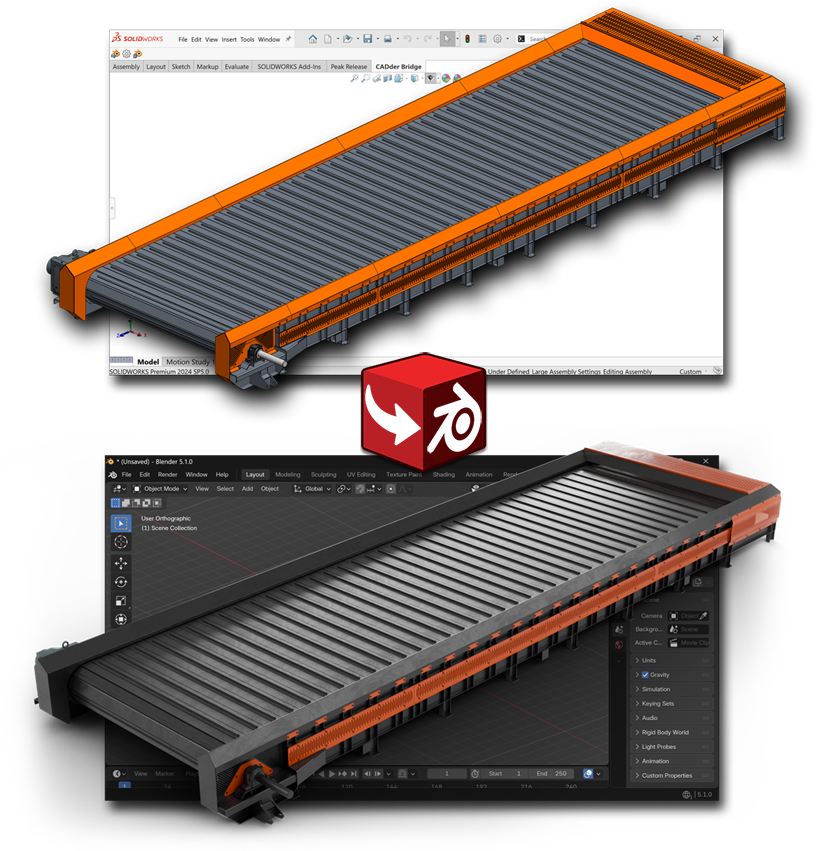
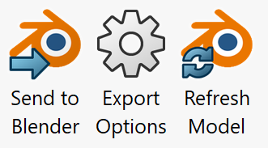

  

<h1 align="center">CADder - SolidWorks Blender Bridge</h1>

  <strong>Send a SolidWorks assembly to Blender with one button: the geometry, the appearances and a rig that moves.</strong> 
  <a href="https://github.com/Peak-Design/CADder-SW-Bridge/releases/latest">Download</a> ·
  <a href="#install">Install</a> ·
  <a href="#use">Use</a> ·
  <a href="https://github.com/Peak-Design/CADder">CADder for Blender</a> ·
  <a href="https://ko-fi.com/oskarasspalvys">Tip jar</a>

> [!IMPORTANT]
> CADder Bridge is the SolidWorks half of a pair. The Blender half is
> **[CADder](https://github.com/Peak-Design/CADder)**, and you need both.

https://github.com/user-attachments/assets/a1e8aa92-4808-44e7-b1fa-f01936616c86

https://www.youtube.com/watch?v=vcaNa9JF-_M

## What it sends

- **The assembly as you see it.** Parts keep their names and the tree
  keeps its shape. A part used a hundred times is one mesh in Blender.
- **Appearances and decals**, as Blender materials.
- **A rig built from the mates.** Joints, limits drawn to the real values,
  and gears, screws, cams and symmetry that drive each other.
- **Updates, not re-imports.** Refresh Model brings the Blender scene up
  to date and keeps your materials, modifiers and animation.

## Install

You need Windows 10 or 11 (64-bit), SolidWorks 2022 or newer, and
Blender 5.1 with [CADder](https://github.com/Peak-Design/CADder).

1. In Blender, install CADder and tick **SolidWorks Bridge** in its
   preferences.
2. Close SolidWorks. Run `CADder-Bridge-<version>-setup.exe` from
   [Releases](https://github.com/Peak-Design/CADder-SW-Bridge/releases/latest).
3. Start SolidWorks. The **CADder Bridge** tab is on the ribbon.

The installer is not signed yet, so Windows may show **Windows protected
your PC**. Click **More info**, then **Run anyway**. To remove the add-in,
use **Settings > Apps > Installed apps**.

## Use

  

| Button | What it does |
|---|---|
| **Send to Blender** | Sends the open assembly. Starts Blender if it is not running. |
| **Export Options** | What a send carries: mesh quality, appearances, the rig, and what Blender does when it arrives. |
| **Refresh Model** | Brings the Blender scene up to date with this assembly, part by part. |

Blender can ask for a part again, finer or coarser, with **Rebuild from
CAD** in the CADder tab.

## For the best rig

What moves in SolidWorks is what moves in Blender, so the rig is only as
good as the assembly under it.

- **Fully define the assembly.** Anything loose in SolidWorks is loose in
  Blender.
- **Fix mate errors, and leave nothing over defined.** The add-in reads
  what SolidWorks has solved.
- **Lock your fasteners.** A bolt on a concentric mate can spin, so it
  gets a bone of its own.
- **Make flexible what should move.** A rigid subassembly is one body. A
  flexible one is solved inside.

The rig is a very good starting point, not your design intent. An
excavator arm arrives as three joints because the mates say so. Add an IK
constraint yourself if you want one handle on the bucket.

This is a first release, tested against a set of assemblies built for the
purpose. If it gets yours wrong,
[open an issue](https://github.com/Peak-Design/CADder-SW-Bridge/issues) and
attach the file if you can. That is how it gets better.

## For developers

| Path | Contents |
|---|---|
| [`sw-addin/`](sw-addin/) | The SolidWorks add-in (C#, .NET Framework 4.8). Build, test and install notes in [its README](sw-addin/README.md). |
| [`schema/`](schema/) | The rig manifest: the contract between the two halves. [SCHEMA.md](schema/SCHEMA.md) says what it means. |

The Blender half is the `rig/` package of
[CADder](https://github.com/Peak-Design/CADder). The halves share no code,
only the manifest, so either can be replaced by any program that follows
the contract.

## Licences

- The add-in is **MIT** ([sw-addin/LICENSE](sw-addin/LICENSE)). The
  SolidWorks interop assemblies belong to Dassault Systèmes and are not
  covered, see [THIRD-PARTY-NOTICES.md](sw-addin/THIRD-PARTY-NOTICES.md).
- CADder, the Blender half, is **GPL-3.0-or-later**, as Blender add-ons
  must be.

The manifest keeps the two apart: code crosses the boundary in neither
direction, only the contract in `schema/` does.

## Credits

Made by **Peak Design** (Oskaras Spalvys). If CADder Bridge saves you
time, a tip helps keep it going:

